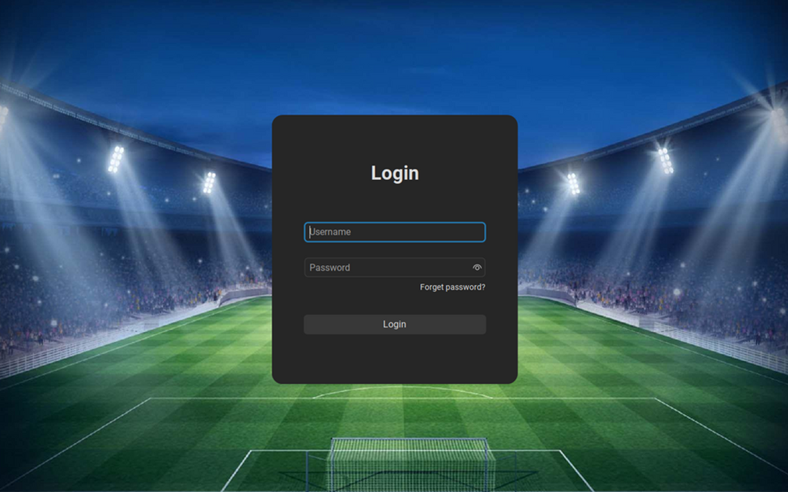
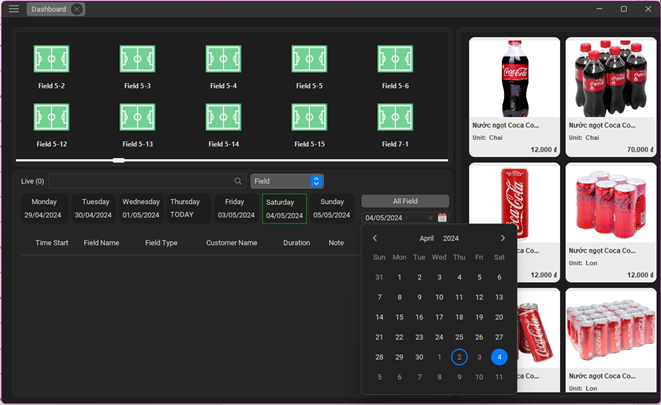
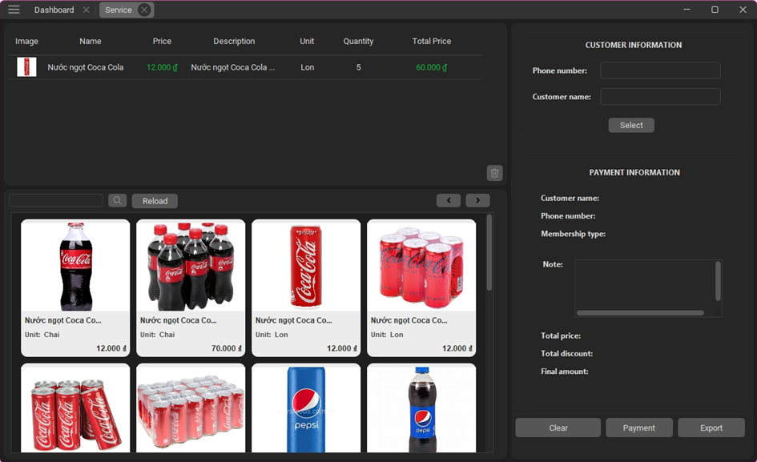
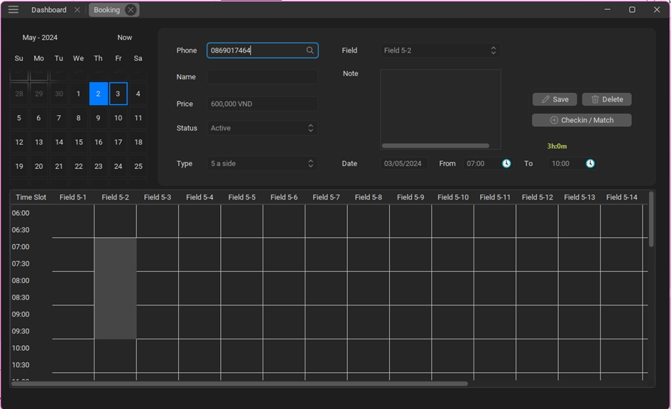

# Mini Football Field Management Application
## Introduction
The Mini Football Field Management Application is an IT project designed to enhance the efficiency and convenience of managing football fields.

## Technologies Used
* Java Swing
* MVC Pattern
* MySQL

## Installation and Setup
### Clone the repository
```bash
git clone https://github.com/chickenHuy/MiniSoccerFieldManagement-Desktop.git
```
### Backup the database
* Backup the database file `dump_db_mnsf.sql` in the `database` folder to your MySQL database.
* Change the database connection information in the `DBConnection.java` file in the `src/dao` folder.

### Run the application
* Open the project in NetBeans IDE and run the project.

## Some image of the application

*Login*



*Dashboard*



*Service*



*Field booking*



